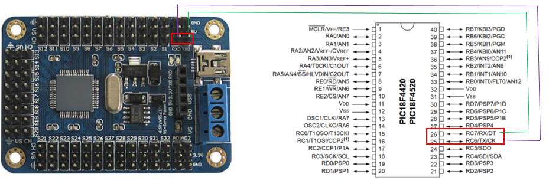
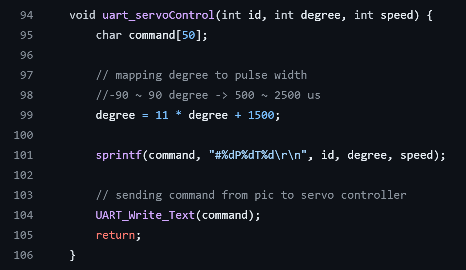
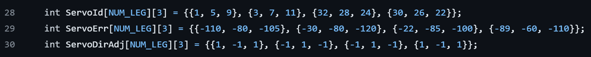
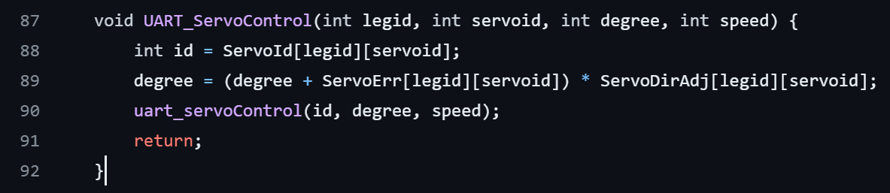
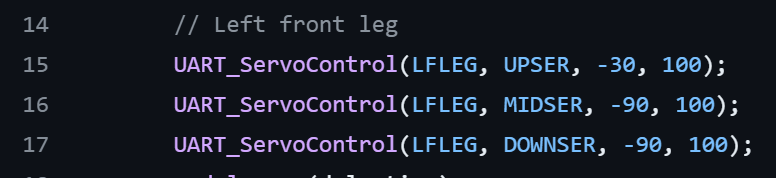
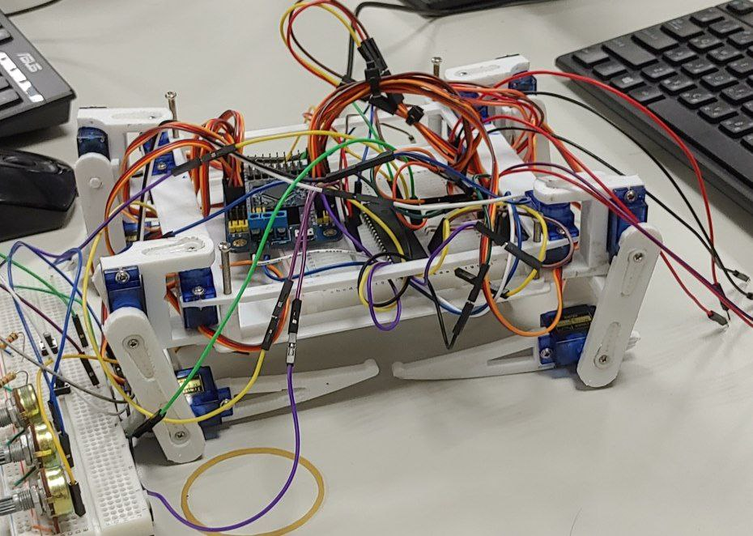
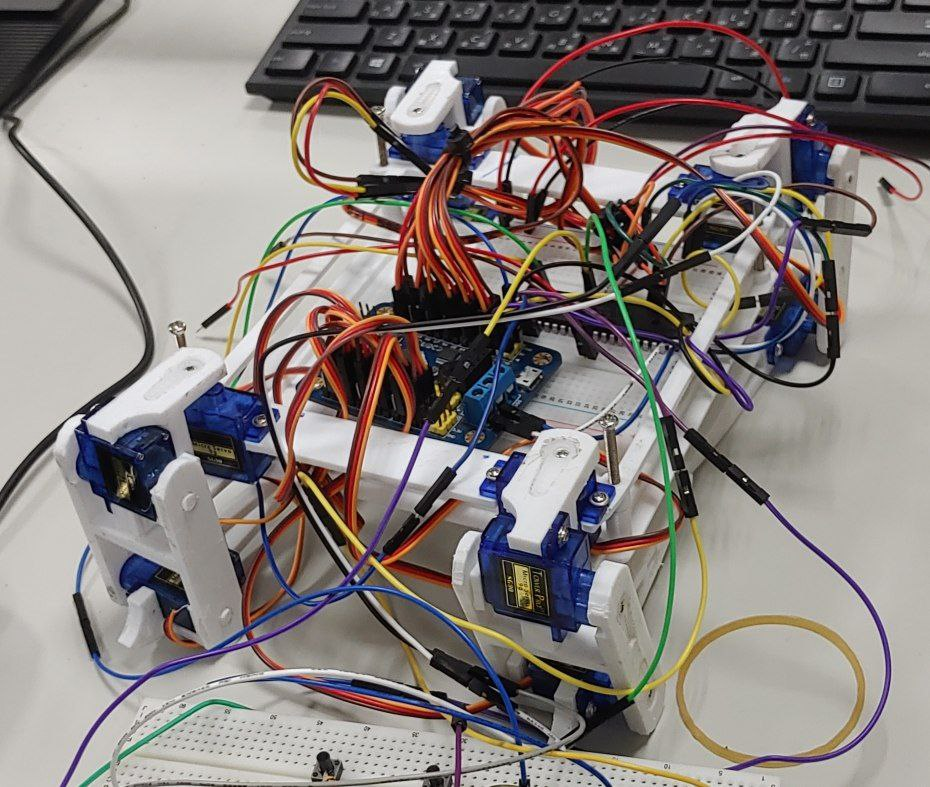
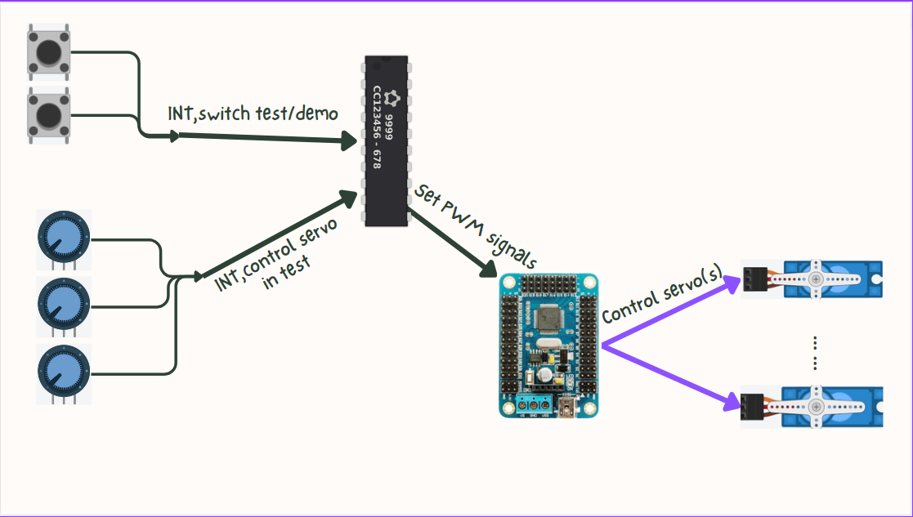
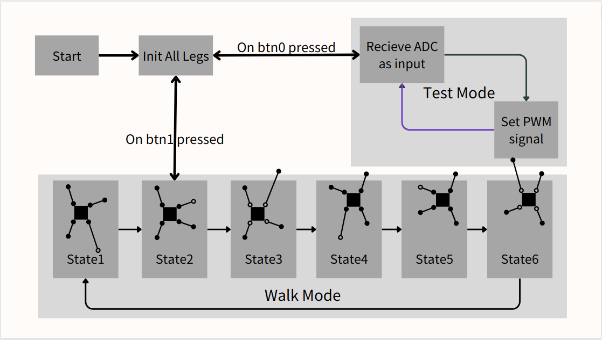
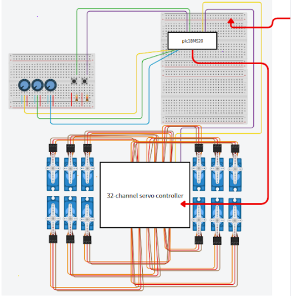

# Quadruped-Robot

## 2023 微算機期末專題 - 系統文件 組員：林宸顗、周嘉豪、蔡聿善、蔡誠穎

## 主題：四腳仿生獸 (可以移動的機器人)

### **1.** 專題動機

這個 AI 蓬勃發展的時代，機器寵物或工作機器人勢必會成為下一波潮流，但要有可愛的機器寵物要先有由小型終端組成的機器人，因此我們這組想要透過 pic18f 實作由 servo 搭配 3D 列印零件的四腳仿生獸，並試著在有限時間達成基本動作。

### **2.** 使用環境及對象

#### **1.** 室內環境監控

四腳仿生獸裝上額外的裝置後，便可產生不同的用途，如攝像頭、濕度探測儀、温度計等，仿生獸在室內環境走動時，便可以將收集到的數據回傳使用者。這可以用來監視工廠、倉庫、温室等需要有一定環境質量要求的室內環境，仿生機器人可以用來確保環境符合特定的標準以及安全規定。

#### **2.** 醫療應用

在醫療領域中，仿生機器人可以執行一些簡單的任務，如收集病人的基本狀態資料。在疫情期間，醫護的數量供不應求，在人手短缺的情況下，仿生機器人的作用可以減輕醫護的負擔，每間病房可以安置一個機器人，監測病人的異常狀況並實時回報，能夠在特殊狀況發生時，以最快時間通知醫護。

### **3.** 使用元件

**pic18f**晶片 **x1** 伺服馬達 **x12** **A/D** **converter** **x3** >

**32-channel** **servo** **controller** **x1** **3D**列印仿生獸模型
**x1**

**Button** **x2**

**32-channel** **servo** **controller**

### **4.** 功能與原理說明

功能：通過按鈕與 ADC 去控制仿生獸前進動作

原理：利用 pic18f 上的 UART 傳送控制馬達的指令到 32-channel servo controller，控制各關節的十二個馬達轉動角度以及速度，使仿生獸完成不同的動作。而各個腿部動作再會被封裝一些函數，再通過按鈕和 ADC 作為轉入參數，控制仿生獸作出前進、轉向等動作。

#### 各單元用途：

##### **1. UART**

UART 的作用是溝通 pic18f 晶片與 32-channel servo controller，如下圖所示，pic18f 中的口 RX 與 TX pin 需接到 32-channel servo controller 中的 TXD 與 RXD 中，由於 32-channel servo controller 的 buad rate 需設為 9600/19200/38400/57600/115200/12800。而我們採用的 buad rate 值是 9600。

參數設置：

OSCCON bit 2-0 : 111 (8MHz) TXSTAbits.SYNC = 0 BAUDCONbits.BRG16 = 0
TXSTAbits.BRGH = 1
SPBRG = 51

註:這幾項是把 buad rate 設成 9600

而 32-channel servo controller 的控制馬達指令為
\#\<ch\>P\<pw\>T\<time\>\r\n

其中：\<ch\>是 channel 的 id (1-32，共 32 個 channel)

\<pw\>是 pulse width，範圍是 500-2500，單位是 microseconds
\<time\>是把馬達轉到目標角度這過程的時間 \r\n 代表指令的結束

如”#8P600T1000\r\n”是把 channel 8 上的馬達設成 600 pulse width，這過程 1 秒。

應用：

可以通過 UART 發送特定指令設置想控制馬達的角度(-90 ~ 90)度，通過綫性轉換把 500~2400 的 pulse width 轉換成-90 ~ 90 度，而 UART_Write_Text(command)則是 Lab10 中把字串傳到 terminal 的函數，在這裡則是從晶片把控制馬達的指令傳到 Servo Controller

##### **2.** **Servo**

由於伺服馬達在安裝的時候會有些許的誤差，以及每個馬達旋轉方向不統一，這樣會讓程式在撰寫會比較困難，因此我們統計了每個碼的的誤差與方向，統整了一個誤差與方向補正表，並且寫一個 function 去 call uart_sevoControl，使得我們可以只要傳入機器腳代號、馬達代號、角度(統一後)、delay，即可控制馬達。

角度統一為：

所有上馬達往內縮到最內部為 0 度，向外轉為正轉，向內轉為反轉。

所有中馬達手臂與地面垂直為 0 度，往上為正轉，往下為反轉。

所有下馬達手臂與地面平行為 0 度，往上為正轉，往下為反轉。

如上圖為全部 0 度。

##### **3.** **ADC** **(low** **priority)**

控制一隻腳的旋轉，方便獲取數值和調整。

三個可變電阻分別占用 3 個 channel，當進入 ADC 狀態時，對這三個進行循環 GO，也就是 channel0 先 GO，之後換 channel1、channel2、channel0 ……以此循環不斷更新數值。另外，因為採取 left justification 數值為 0~255，我們將數值縮放到-90~90，以利 Servo Controller 控制伺服馬達。

##### **4.** **Interrupt** **(high** **priority)**

按鈕皆是以 pull-down resistor 的方式實作。
INT0 腳位連接一個按鈕
負責控制走路和停止走路。在 ADC 控制狀態下按此按鈕會進入走路狀態並清除 ADC enable bit，再按一次會回到走路初始狀態。

INT1 腳位連接一個按鈕
走路時不會有任何作用。在停止走路狀態按下會進入 ADC 狀態，在按一次會結束進入走路初始狀態。

### **5.** 架構圖

### **6.** 流程圖

### **7.** 電路圖設計

### **8.** 開發工具、材料及技術 **1.** **3D**列印

仿生獸的主題是通過 3D 列印技術來製成，先用 3D 建模軟件設計仿生獸的零件，當中需要設計伺服馬達的鑲嵌孔，以及零件之間的鑲嵌孔，再列印部分零件作測試，直到樣品達到我們預期的效果，才把全部零件列印出來，再把整個仿生機器人與馬達拼在一起。

### **9.** 周邊接口

#### **1.** **32-channel** **servo** **controller**

32-channel servo controller 用於同時控制多個伺服馬達的運行，其原理是接收到 pic 晶片傳送的指令後便會控制各 channel 的馬達轉動，其電路連接圖在第六部分有作詳解，主要是要接兩條電源線來供電，若使用 mirco-usb 來提供電源，則可以少一條杜邦線接向麵包板的電源，但真正過行時，為避免電線過長影響過長，會使用電源供應器來供電。

### **10.** 分工

- 硬體設計與列印：蔡誠穎

- 伺服馬達 API 設計與統一：蔡聿善

- 動作設計與實作：林宸顗

- 硬體測試與 PWM 串接測試與實作：周嘉豪

### **11.** 如何解決困難

#### **1、3D** 列印拆除

我們的設計是舵臂會卡入 3D 元件藉此來控制元件旋轉，所以元件上有凹槽以嵌入舵臂，但這種洞穴型的結構非常不好拆除，在沒有工具的情況下我們完全拆不出來。最後是利用工作室的工具在人員的協助下，拆除完善。

#### **2、** 伺服馬達統一

在最初配置時，我們是以實際硬體 hard code 的方式給每個伺服馬達角度，達成站立與步行，但是組員指出此實作方式的不易維護、思考及溝通困難，最後，我們著手於統一思想，對馬達的數值做虛擬化，達成一致與方便可視化的功能，也就是我們在各單元用途中 Servo 所達成的。

#### **3** 、 重心不穩導致無法步行

一開始，每一步都只靠一個馬達旋轉來達成抬腳、腳往前、放下的功能，而重心也未考慮周全，因此只要一抬腳機器人就會外八加上往前大幅度的傾倒，把重心大部分放到剛才移動的腳，造成無法移動下一隻腳，最後越移越糟。
我們發現，若只透過一個馬達來達成大部分動作，會導致動作精細度不夠高，產生很多無法預期的錯誤，如：一顆馬達抬腳，末端沒有處理(旋轉)，在抬腳時會造成微小的推移使得機器人外八，因此我們讓小腿和腳末端在抬的過程，同時做相反的旋轉，進而達到直上直下，類似公雞頭的功能。而我們在腳步的處理也更加細緻，考慮到重心所造成的傾斜，我們必須更分散支撐點，讓三點組成的三角形會包圍重心，達成在舉腿的過程中不會傾斜，此處細節我們在流程圖有做探討。

#### **4**、 電源供應

我們需要 12 個伺服馬達，在負載時所需安培會增加。馬達控制器提供一個蜂鳴器，當電源不足時會鳴叫提醒，我們發現馬達電力不足時力量不夠，蜂鳴器會響。因為我們沒有電源供應器，這對我們來說是一個麻煩的問題，最後我們只好和湊齊組員的 UART 線並接上手機的麵包頭(需確認輸出為 5V 與安培數是否足夠)，我們共用 3 條 UART 線供馬達，1 條供馬達控制器。另外，馬達的電是與 Button、ADC、PIC18f 共用的。

#### **5、** 軟體模擬**PWM**

最早開始做之前我們沒有想到使用 Servo Controller，我們打算用單個 pic18f 達成多個 PWM，也就是透過軟體在 normal PORT 上模擬 PWM，但實做完發現 pic18f 的運算速度太慢，沒辦法處理週期是 2ms，duty cycle 須是 2400us ~ 500us 的運算，也許可以處理一兩個馬達，但這樣仍會需要很多 pic18f，考量到此，我們選用 Servo Controller 的方法完成我們的專題。

[**3D 列印檔案與影片檔**](https://drive.google.com/drive/folders/118ZHws-JRtLsTKfmPHXW21xTeo0Up7VQ?usp=sharing)

[**影片觀看**](https://youtube.com/shorts/6BHDyKmPA50?feature=share)
